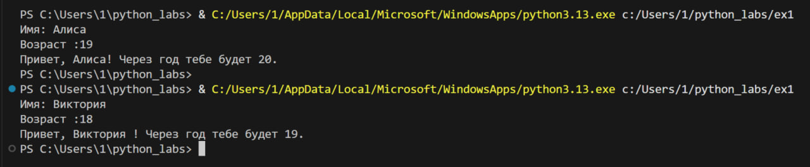
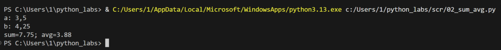
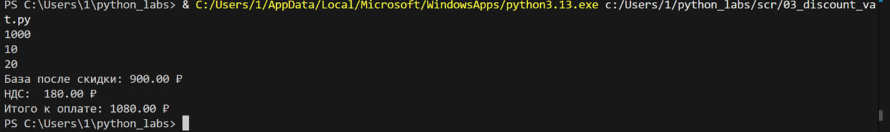
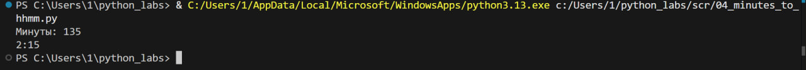
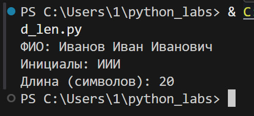

### Лабораторная работа 1
## Задание 1
```python
name = input("Имя: ")
age = int(input("Возраст :"))
age1= age + 1
print(f"Привет, {name}! Через год тебе будет {age1}.")
```

## Задание 2
```python
a=float(input("a: ").replace(',','.'))
b=float(input("b: ").replace(',','.'))
sum=a+b
avg=sum/2
print(f"sum={sum:.2f}; avg={avg:.2f}")
```

## Задание 3
```python
price=float(input())
discount=float(input())
vat=float(input())
base = price * (1 - discount/100)
vat_amount = base * (vat/100)
total = base + vat_amount
print(f"База после скидки: {base:.2f} ₽")
print(f"НДС:  {vat_amount:.2f} ₽")
print(f"Итого к оплате: {total:.2f} ₽")
```

## Задание 4
```python
m=int(input("Минуты: "))
hour=m//60
m1=m%60
print(f"{hour}:{m1}")
```

## Задание 5
```python
name=input("ФИО: ").strip()
part=name.split()
length=len(''.join(part))+2
ini=''.join([i[0].upper() for i in part])
print(f"Инициалы: {ini}")
print(f"Длина (символов): {length}")
```
