## Лабораторная работа 2

### Задание 1
```python
def min_max(nums: list[float | int]) -> tuple[float | int, float | int]:
    if not nums:
        raise ValueError("Пустой список!!!")
    m1=min(nums)
    m2=max(nums)
    return(m1, m2)
print(min_max([3, -1, 5, 5, 0]))
print(min_max([42]))
print(min_max([-5, -2, -9]))
print(min_max([1.5, 2, 2.0, -3.1]))
print(min_max([]))
```
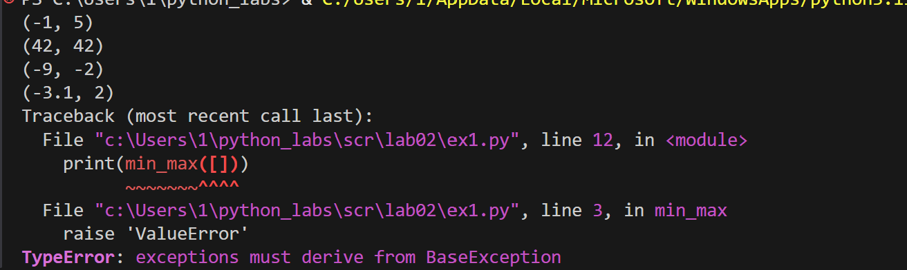

### Задание 2
```python
def unique_sorted(nums):
    return sorted(set(nums))
print(unique_sorted([3, 1, 2, 1, 3]))
print(unique_sorted([]))
print(unique_sorted([-1, -1, 0, 2, 2]))
print(unique_sorted([1.0, 1, 2.5, 2.5, 0]))

```

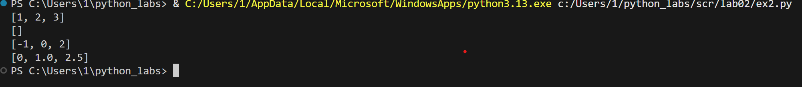


### Задание 3
```python
def flatten(mat: list[list | tuple]) -> list:
    a=[]
    for i in mat:
        for j in i:
            if str(j) in "0123456789":
                a.append(j)
            else:
                raise "TypeError"
    return a
print(flatten([[1, 2], [3, 4]]))
print(flatten(([1, 2], (3, 4, 5))))
print(flatten([[1], [], [2, 3]]))
print(flatten([[1, 2], "ab"]))

```
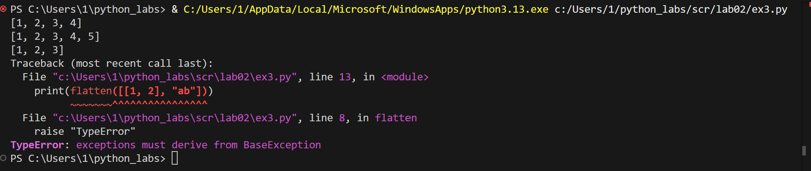

### Задание 4
```python
def transpose(mat: list[list[float | int]]) -> list[list]:
    if not mat:
        return []

    rw_len = len(mat[0])
    for rw in mat:
        if len(rw) != rw_len:
            raise 'ValueError'

    rw, cl = len(mat), rw_len
    result = []

    for j in range(cl):
        new_rw = []
        for i in range(rw):
            new_rw.append(mat[i][j])
        result.append(new_rw)
    return result


print(transpose([[1, 2, 3]]))
print(transpose([[1], [2], [3]]))
print(transpose([[1, 2], [3, 4]]))
print(transpose([]))
print(transpose([[1, 2], [3]]))
```
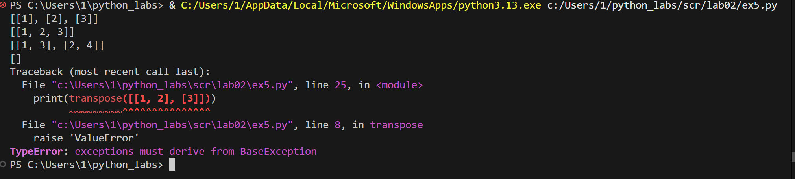

### Задание 5
```python
def row_sums(mat: list[list[float | int]]) -> list[float]:
    if not mat or any(len(row) != len(mat[0]) for row in mat): raise ValueError
    return [float(sum(row)) for row in mat]


print(row_sums([[1, 2, 3], [4, 5, 6]]))
print(row_sums([[-1, 1], [10, -10]]))
print(row_sums([[0, 0], [0, 0]]))
print(row_sums([[1, 2], [3]]))
```
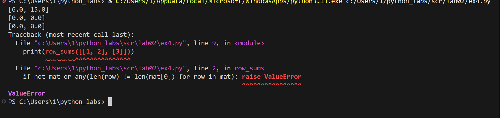

### Задание 6
```python
def col_sums(mat: list[list[float | int]]) -> list[float]:
    if not mat:
        return []

    rw_len = len(mat[0])
    for rw in mat:
        if len(rw) != rw_len:
            raise 'ValueError'

    rw, cl = len(mat), rw_len
    result = []

    for j in range(cl):
        t = 0
        for i in range(rw):
            t += mat[i][j]
        result.append(float(t))
    return result


print(col_sums([[1, 2, 3], [4, 5, 6]]))
print(col_sums([[-1, 1], [10, -10]]))
print(col_sums([[0, 0], [0, 0]]))
print(col_sums([[1, 2], [3]]))
```
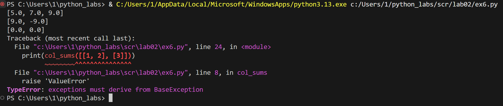

### Задание 7
```python
def format_record(student: tuple[str, str, float]) -> str:
    if len(student) != 3:
        raise "ValueError"
    if not (isinstance(student[0], str) and isinstance(student[1], str) and isinstance(student[2],float)):
        return "TypeError"
    fio_parts = student[0].split()
    result = fio_parts[0].title() + " " + fio_parts[1][0].upper()
    if len(fio_parts) == 3:
        result += "." + fio_parts[2][0].upper() + "., "
    else:
        result += "., "
    result += "гр. " + student[1] + ", GPA " + f"{round(student[2], 2):.2f}"
    return result

a = ("Иванов Иван Иванович", "BIVT-25", 4.6)
b = ("Петров Пётр", "IKBO-12", 5.0)
c = ("Петров Пётр Петрович", "IKBO-12", 5.0)
d = ("  сидорова  анна   сергеевна ", "ABB-01", 3.999)
x = (" ", " ",1)
print(format_record(a))
print(format_record(b))
print(format_record(c))
print(format_record(d))
print(format_record(x))
```
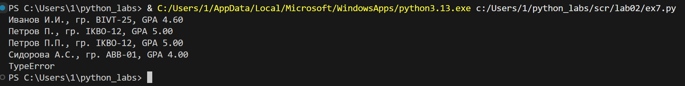()


## Лабораторная работа 3

### normalize
```python
def normalize(text: str, *, casefold: bool = True, yo2e: bool = True) -> str:#casefold приводит к нижнему регистру
    text = text.casefold()
    if yo2e:
        text = text.replace('ё', 'е').replace('Ё', 'Е')
    text = text.replace('\t', ' ').replace('\r', ' ').replace('\n', ' ') #отступ,курсоср в начало сторки,переход на строку ниже
    text = ' '.join(text.split()) #разбивает строку по пробелма и собирает обратно с одним пробелом 
    text = text.strip() #удаляет пробелы в начале и конце строки
    return text
print(normalize("ПрИвЕт\nМИр\t")) 
print(normalize("ёжик, Ёлка"))
print(normalize("Hello\r\nWorld"))
print(normalize("  двойные   пробелы  "))


```
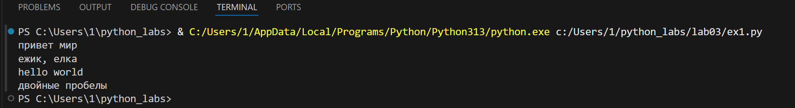

### tokenize
```python
import re #библиотека для работы с регулярными выражениями
def tokenize(text: str) -> list[str]:
    return re.findall(r'\w+(?:-\w+)*', text)
print(tokenize("привет мир"))
print(tokenize("hello,world!!!"))
print(tokenize("по-настоящему круто"))
print(tokenize("2025 год"))
print(tokenize("emoji 😀 не слово"))
```
    
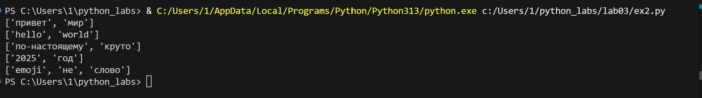


### count_freq + top_n
```python
def count_freq(tokens: list[str]) -> dict[str, int]:
    cnt = {}  
    for w in tokens:
        cu = cnt.get(w, 0)
        cnt[w] = cu + 1
    return cnt
def top_n(freq: dict[str, int], n: int = 5) -> list[tuple[str, int]]:
    t = []
    for w, count in freq.items():#получаем пары(слово,кол-во)
        t.append((-count, w))#создаем кортеж(минус для сортировки)
    t.sort()
    result = []
    for neg_count, w in t:
        result.append((w, -neg_count))#(- для коспенсации пред минуса)
    return result[:n]
tok = ["a", "b", "a", "c", "b", "a"]
freq = count_freq(tok)
print(top_n(freq, n=2))
tok_2 = ["bb", "aa", "bb", "aa", "cc"]
freq_2 = count_freq(tok_2)
print(top_n(freq_2, n=2))

```
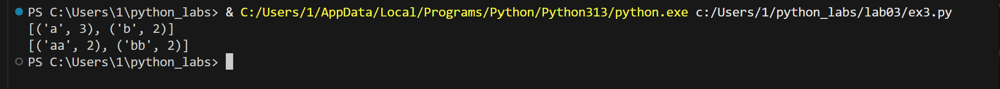

### src/text_stats.py 
```python
from lib.text import normalize, tokenize, count_freq, top_n
import sys
def main():
    text = sys.stdin.buffer.read().decode('utf-8') #вход к бинарным данным,преобразует строку в юникод
    if not text.strip():
        print("Нет входных данных")
        return
    normalized_text = normalize(text)
    tokens = tokenize(normalized_text)
    

    if not tokens:
        print("В тексте не найдено слов")
        return

    total_words = len(tokens) # общее количество слов
    freq_dict = count_freq(tokens) # словарь частот
    unique_words = len(freq_dict) # количеситво уникальных слов 
    top_words = top_n(freq_dict, 5) # самые популярные частоты
    
    print(f"Всего слов: {total_words}")
    print(f"Уникальных слов: {unique_words}")
    print("Топ-5:")
    for word, count in top_words:
        print(f"{word}: {count}")


if __name__ == "__main__":  
    main()
```
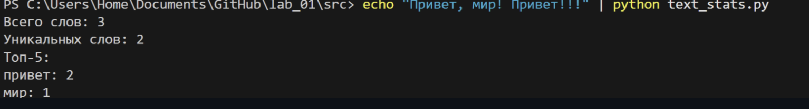
# Лаборторная работа 4
## Задание A — io_txt_csv.py
```python
import csv
from pathlib import Path
from typing import Iterable, Sequence

def read_text(path: str | Path, encoding: str = "utf-8") -> str:
    try:
        return Path(path).read_text(encoding=encoding)
    except FileNotFoundError:
        return "Такого файла нету"
    except UnicodeDecodeError:
        return "Неудалось изменить кодировку"

def write_csv(rows: list[tuple | list], path: str | Path, header: tuple[str, ...] | None = None) -> None:
    p = Path(path)
    with p.open('w', newline="", encoding="utf-8") as file: # контроль переноса строк,кодироввка файла
        f = csv.writer(file)
        if header is None and rows == []: # нет заголовка и данных
            file_c.writerow(('a', 'b')) 
        if header is not None:
            f.writerow(header)
        if rows != []:
            const = len(rows[0])
            for i in rows:
                if len(i) != const:
                    return ValueError
        f.writerows(rows)

def ensure_parent_dir(path: str | Path) -> None:
    Path(path).parent.mkdir(parents=True, exist_ok=True)

print(read_text(r"c:\Users\1\python_labs\data\input.txt"))
write_csv([("word","count"),("test",3)], r"c:\Users\1\python_labs\data\check.csv") 
```
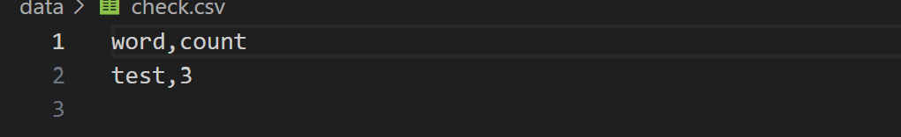
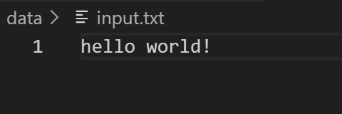

## Задание B — text_report.py
```python
from io_txt_csv import read_text, write_csv, ensure_parent_dir
import sys
from pathlib import Path

sys.path.append(r'c:\Users\1\python_labs\lib')

from lib.text import normalize, tokenize, count_freq, top_n

def exist_path(path_f: str):
    return Path(path_f).exists()


def main(file: str, encoding: str = 'utf-8'):
    if not exist_path(file):
        raise FileNotFoundError
    
    file_path = Path(file)
    text = read_text(file, encoding=encoding)
    norm = normalize(text)
    tokens = tokenize(norm)
    freq_dict = count_freq(tokens)
    top = top_n(freq_dict, 5)
    top_sort = sorted(top, key=lambda x: (x[1], x[0]), reverse=True)
    report_path = file_path.parent / 'report.csv'
    write_csv(top_sort, report_path, header=('word', 'count'))
    
    print(f'Всего слов: {len(tokens)}')
    print(f'Уникальных слов: {len(freq_dict)}')
    print('Топ-5:')
    for cursor in top_sort:
        print(f'{cursor[0]}: {cursor[-1]}')


main(r'c:\Users\1\python_labs\data\input.txt')
```
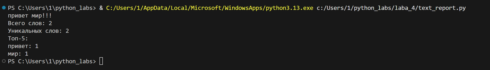
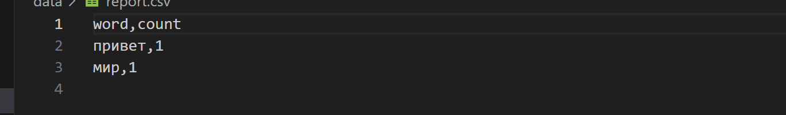