## Лабораторная работа 2

### Задание 1
```python
def min_max(nums: list[float | int]) -> tuple[float | int, float | int]:
    if not nums:
        raise ValueError("Пустой список!!!")
    m1=min(nums)
    m2=max(nums)
    return(m1, m2)
print(min_max([3, -1, 5, 5, 0]))
print(min_max([42]))
print(min_max([-5, -2, -9]))
print(min_max([1.5, 2, 2.0, -3.1]))
print(min_max([]))
```


### Задание 2
```python
def unique_sorted(nums):
    return sorted(set(nums))
print(unique_sorted([3, 1, 2, 1, 3]))
print(unique_sorted([]))
print(unique_sorted([-1, -1, 0, 2, 2]))
print(unique_sorted([1.0, 1, 2.5, 2.5, 0]))

```


### Задание 3
```python
def flatten(mat: list[list | tuple]) -> list:
    a=[]
    for i in mat:
        for j in i:
            if str(j) in "0123456789":
                a.append(j)
            else:
                raise "TypeError"
    return a
print(flatten([[1, 2], [3, 4]]))
print(flatten(([1, 2], (3, 4, 5))))
print(flatten([[1], [], [2, 3]]))
print(flatten([[1, 2], "ab"]))

```


### Задание 4
```python
def transpose(mat: list[list[float | int]]) -> list[list]:
    if not mat:
        return []

    rw_len = len(mat[0])
    for rw in mat:
        if len(rw) != rw_len:
            raise 'ValueError'

    rw, cl = len(mat), rw_len
    result = []

    for j in range(cl):
        new_rw = []
        for i in range(rw):
            new_rw.append(mat[i][j])
        result.append(new_rw)
    return result


print(transpose([[1, 2, 3]]))
print(transpose([[1], [2], [3]]))
print(transpose([[1, 2], [3, 4]]))
print(transpose([]))
print(transpose([[1, 2], [3]]))
```


### Задание 5
```python
def row_sums(mat: list[list[float | int]]) -> list[float]:
    if not mat or any(len(row) != len(mat[0]) for row in mat): raise ValueError
    return [float(sum(row)) for row in mat]


print(row_sums([[1, 2, 3], [4, 5, 6]]))
print(row_sums([[-1, 1], [10, -10]]))
print(row_sums([[0, 0], [0, 0]]))
print(row_sums([[1, 2], [3]]))
```


### Задание 6
```python
def col_sums(mat: list[list[float | int]]) -> list[float]:
    if not mat:
        return []

    rw_len = len(mat[0])
    for rw in mat:
        if len(rw) != rw_len:
            raise 'ValueError'

    rw, cl = len(mat), rw_len
    result = []

    for j in range(cl):
        t = 0
        for i in range(rw):
            t += mat[i][j]
        result.append(float(t))
    return result


print(col_sums([[1, 2, 3], [4, 5, 6]]))
print(col_sums([[-1, 1], [10, -10]]))
print(col_sums([[0, 0], [0, 0]]))
print(col_sums([[1, 2], [3]]))
```


### Задание 7
```python
def format_record(student: tuple[str, str, float]) -> str:
    if len(student) != 3:
        raise "ValueError"
    if not (isinstance(student[0], str) and isinstance(student[1], str) and isinstance(student[2],float)):
        return "TypeError"
    fio_parts = student[0].split()
    result = fio_parts[0].title() + " " + fio_parts[1][0].upper()
    if len(fio_parts) == 3:
        result += "." + fio_parts[2][0].upper() + "., "
    else:
        result += "., "
    result += "гр. " + student[1] + ", GPA " + f"{round(student[2], 2):.2f}"
    return result

a = ("Иванов Иван Иванович", "BIVT-25", 4.6)
b = ("Петров Пётр", "IKBO-12", 5.0)
c = ("Петров Пётр Петрович", "IKBO-12", 5.0)
d = ("  сидорова  анна   сергеевна ", "ABB-01", 3.999)
x = (" ", " ",1)
print(format_record(a))
print(format_record(b))
print(format_record(c))
print(format_record(d))
print(format_record(x))
```
()


## Лабораторная работа 3

### normalize
```python
def normalize(text: str, *, casefold: bool = True, yo2e: bool = True) -> str:#casefold приводит к нижнему регистру
    text = text.casefold()
    if yo2e:
        text = text.replace('ё', 'е').replace('Ё', 'Е')
    text = text.replace('\t', ' ').replace('\r', ' ').replace('\n', ' ') #отступ,курсоср в начало сторки,переход на строку ниже
    text = ' '.join(text.split()) #разбивает строку по пробелма и собирает обратно с одним пробелом 
    text = text.strip() #удаляет пробелы в начале и конце строки
    return text
print(normalize("ПрИвЕт\nМИр\t")) 
print(normalize("ёжик, Ёлка"))
print(normalize("Hello\r\nWorld"))
print(normalize("  двойные   пробелы  "))


```


### tokenize
```python
import re #библиотека для работы с регулярными выражениями
def tokenize(text: str) -> list[str]:
    return re.findall(r'\w+(?:-\w+)*', text)
print(tokenize("привет мир"))
print(tokenize("hello,world!!!"))
print(tokenize("по-настоящему круто"))
print(tokenize("2025 год"))
print(tokenize("emoji 😀 не слово"))
```
    


### count_freq + top_n
```python
def count_freq(tokens: list[str]) -> dict[str, int]:
    cnt = {}  
    for w in tokens:
        cu = cnt.get(w, 0)
        cnt[w] = cu + 1
    return cnt
def top_n(freq: dict[str, int], n: int = 5) -> list[tuple[str, int]]:
    t = []
    for w, count in freq.items():#получаем пары(слово,кол-во)
        t.append((-count, w))#создаем кортеж(минус для сортировки)
    t.sort()
    result = []
    for neg_count, w in t:
        result.append((w, -neg_count))#(- для коспенсации пред минуса)
    return result[:n]
tok = ["a", "b", "a", "c", "b", "a"]
freq = count_freq(tok)
print(top_n(freq, n=2))
tok_2 = ["bb", "aa", "bb", "aa", "cc"]
freq_2 = count_freq(tok_2)
print(top_n(freq_2, n=2))

```


### src/text_stats.py 
```python
from lib.text import normalize, tokenize, count_freq, top_n
import sys
def main():
    text = sys.stdin.buffer.read().decode('utf-8') #вход к бинарным данным,преобразует строку в юникод
    if not text.strip():
        print("Нет входных данных")
        return
    normalized_text = normalize(text)
    tokens = tokenize(normalized_text)
    

    if not tokens:
        print("В тексте не найдено слов")
        return

    total_words = len(tokens) # общее количество слов
    freq_dict = count_freq(tokens) # словарь частот
    unique_words = len(freq_dict) # количеситво уникальных слов 
    top_words = top_n(freq_dict, 5) # самые популярные частоты
    
    print(f"Всего слов: {total_words}")
    print(f"Уникальных слов: {unique_words}")
    print("Топ-5:")
    for word, count in top_words:
        print(f"{word}: {count}")


if __name__ == "__main__":  
    main()
```

# Лаборторная работа 4
## Задание A — io_txt_csv.py
```python
import csv
from pathlib import Path #подключаем путь к файлу
from typing import Iterable, Sequence

def read_text(path: str | Path, encoding: str = "utf-8") -> str:
    try:
        return Path(path).read_text(encoding=encoding)
    except FileNotFoundError:
        return "Такого файла нету"
    except UnicodeDecodeError:
        return "Неудалось изменить кодировку"

def write_csv(rows: list[tuple | list], path: str | Path, header: tuple[str, ...] | None = None) -> None:
    p = Path(path)
    with p.open('w', newline="", encoding="utf-8") as file: # контроль переноса строк,кодироввка файла
        f = csv.writer(file)
        if header is None and rows == []: # нет заголовка и данных
            file_c.writerow(('a', 'b')) 
        if header is not None:
            f.writerow(header)
        if rows != []:
            const = len(rows[0])
            for i in rows:
                if len(i) != const:
                    return ValueError
        f.writerows(rows)

def ensure_parent_dir(path: str | Path) -> None:
    Path(path).parent.mkdir(parents=True, exist_ok=True)

print(read_text(r"c:\Users\1\python_labs\data\input.txt"))
write_csv([("word","count"),("test",3)], r"c:\Users\1\python_labs\data\check.csv") 
```


## Задание B — text_report.py
```python
from io_txt_csv import read_text, write_csv, ensure_parent_dir
import sys
from pathlib import Path

sys.path.append(r'c:\Users\1\python_labs\lib')

from lib.text import normalize, tokenize, count_freq, top_n

def exist_path(path_f: str):
    return Path(path_f).exists()


def main(file: str, encoding: str = 'utf-8'):
    if not exist_path(file):
        raise FileNotFoundError
    
    file_path = Path(file)
    text = read_text(file, encoding=encoding)
    norm = normalize(text)
    tokens = tokenize(norm)
    freq_dict = count_freq(tokens)
    top = top_n(freq_dict, 5)
    top_sort = sorted(top, key=lambda x: (x[1], x[0]), reverse=True)
    report_path = file_path.parent / 'report.csv'
    write_csv(top_sort, report_path, header=('word', 'count'))
    
    print(f'Всего слов: {len(tokens)}')
    print(f'Уникальных слов: {len(freq_dict)}')
    print('Топ-5:')
    for cursor in top_sort:
        print(f'{cursor[0]}: {cursor[-1]}')


main(r'c:\Users\1\python_labs\data\input.txt')
```


## Лабораторная работа 5
### Задание A — JSON ↔ CSV
```python
import json
import csv
from pathlib import Path

def json_to_csv(json_path: str, csv_path: str) -> None:
    """Преобразует JSON-файл в CSV."""
    if Path(json_path).suffix != '.json' or Path(csv_path).suffix != '.csv':
        raise TypeError("Неверное расширение файла")
    
    with open(json_path, encoding="utf-8") as f: 
        data = json.load(f)
    
    if not data or not isinstance(data, list) or not all(isinstance(item, dict) for item in data):
        raise ValueError("Пустой JSON или неподдерживаемая структура")
    
    # Собираем все уникальные ключи из всех объектов
    fieldnames = sorted({key for item in data for key in item.keys()})
    
    with open(csv_path, "w", newline="", encoding="utf-8") as cf:
        writer = csv.DictWriter(cf, fieldnames=fieldnames)
        writer.writeheader()
        for item in data:
            row = {field: item.get(field, '') for field in fieldnames}
            writer.writerow(row)

def csv_to_json(csv_path: str, json_path: str) -> None:
    """Преобразует CSV в JSON (список словарей)."""
    if Path(csv_path).suffix != '.csv' or Path(json_path).suffix != '.json':
        raise TypeError("Неверное расширение файла")
    
    with open(csv_path, 'r', encoding='utf-8', newline='') as cf:
        reader = csv.DictReader(cf)
        lt_rows = list(reader)
        
    if not lt_rows:
        raise ValueError("CSV файл пуст или содержит только заголовок")
    
    with open(json_path, 'w', encoding='utf-8') as jf:
        json.dump(lt_rows, jf, ensure_ascii=False, indent=2)

json_to_csv('C:/Users/1/python_labs/data/samples/people.json', 'C:/Users/1/python_labs/data/out/people_from_json.csv')
csv_to_json('C:/Users/1/python_labs/data/samples/people.csv', 'C:/Users/1/python_labs/data/out/people_from_csv.json')
```
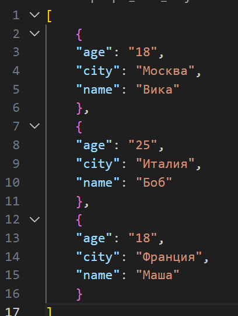


### Задание B — CSV → XLSX

```python
from openpyxl import Workbook
import csv
from pathlib import Path

def csv_to_xlsx(csv_path: str, xlsx_path: str) -> None:
    """Конвертирует CSV в XLSX."""
    if not Path(csv_path).exists():
        raise FileNotFoundError(f"CSV файл не найден: {csv_path}")
    
    wb = Workbook()
    ws = wb.active
    ws.title = "Sheet1"
    
    try:
        with open(csv_path, encoding="utf-8") as f:
            reader = csv.reader(f)
            rows = list(reader)
            
            if not rows:
                raise ValueError("CSV файл пуст")
            
            for row in rows:
                ws.append(row)
            
            # Автоширина колонок
            for column in ws.columns:
                if column:  # Проверяем что колонка не пустая
                    mx = max(len(str(cell.value)) for cell in column)
                    ws.column_dimensions[column[0].column_letter].width = max(mx + 2, 8)
        
        wb.save(xlsx_path)
        
    except csv.Error as e:
        raise ValueError(f"Ошибка чтения CSV: {e}")
    
csv_to_xlsx('C:/Users/1/python_labs/data/samples/cities.csv', 'C:/Users/1/python_labs/data/out/cities.xlsx')
csv_to_xlsx('C:/Users/1/python_labs/data/samples/people.csv', 'C:/Users/1/python_labs/data/out/people.xlsx')
```
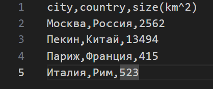
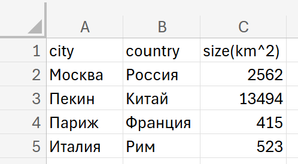
# Лабораторная №6
## Задание 1
``` python
import sys
import os
import argparse
from lib.stats_text import stats_text

def check_file(file_path: str) -> bool:
    if not os.path.exists(file_path):
        print(f"Ошибка: файл '{file_path}' не существует", file=sys.stderr)
        return False
    if not os.path.isfile(file_path):#проверяет, является ли путь именно файлом (а не директорией).
        print(f"Ошибка: '{file_path}' не является файлом", file=sys.stderr)
        return False
    return True

def cat_command(input_file: str, number_lines: bool = False):
    if not check_file(input_file):
        sys.exit(1)
        
    with open(input_file, 'r', encoding='utf-8') as f:
        for i, line in enumerate(f, 1):#перебирает строки файла, но начинает нумерацию с 1
            if number_lines:
                print(f"{i:6d}  {line}", end='') 
            else:
                print(line, end='') 
    

def stats_command(input_file: str, top_n: int = 5):
    if not check_file(input_file): 
        sys.exit(1)
    
    if top_n <= 0:
        print("Ошибка: значение --top должно быть положительным числом", file=sys.stderr)
        sys.exit(1)
    
    with open(input_file, 'r', encoding='utf-8') as f:
        text = f.read()
        stats_text(text, top_n)

def main():
    parser = argparse.ArgumentParser(description="Лабораторная №6")#argparse автоматически понимает, какую подкоманду ты вызвала, и передаёт управление в нужную часть программы
    subparsers = parser.add_subparsers(dest="command")#subparsers позволяет программе иметь несколько разных команд

    cat_parser = subparsers.add_parser("cat", help="Вывести содержимое файла")#предусматривает обязательный аргумент --input, который задаёт путь к читаемому файлу
    cat_parser.add_argument("--input", required=True) 
    cat_parser.add_argument("-n", action="store_true", help="Нумеровать строки")

    stats_parser = subparsers.add_parser("stats", help="Частоты слов")
    stats_parser.add_argument("--input", required=True)
    stats_parser.add_argument("--top", type=int, default=5)#сколько слов выводить, по умолчанию 5

    args = parser.parse_args() #читает аргументы командной строки и в зависимости от команды запускает нужную функцию
    if args.command == "cat":
        cat_command(args.input, args.n)
    elif args.command == "stats":
        stats_command(args.input, args.top)
    else:
        parser.print_help()
        sys.exit(1)

if __name__ == "__main__":
    main()
```
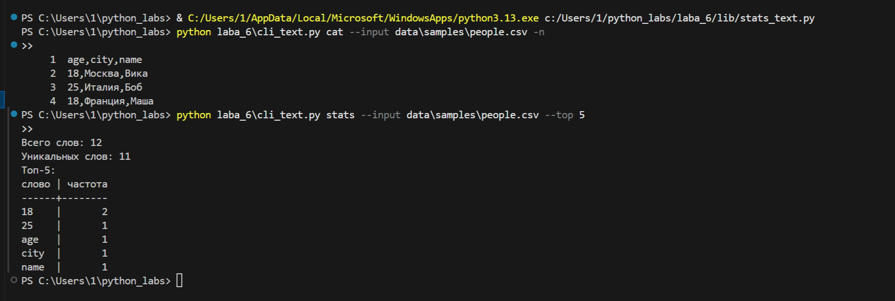

## Задание 2
``` python
import sys
import argparse

from lib.stats_text import csv_to_xlsx
from lib.stats_text import json_to_csv
from lib.stats_text import csv_to_json
from cli_text import check_file


def main():
    # создааем подкоманды
    parser = argparse.ArgumentParser(description="Конвертеры данных")
    sub = parser.add_subparsers(dest="command", required=True) 
    
    p1 = sub.add_parser("json2csv")
    p1.add_argument("--in", dest="input", required=True, help="Входной JSON файл")
    p1.add_argument("--out", dest="output", required=True, help="Выходной CSV файл")

    p2 = sub.add_parser("csv2json")
    p2.add_argument("--in", dest="input", required=True, help="Входной CSV файл")
    p2.add_argument("--out", dest="output", required=True, help="Выходной JSON файл")

    p3 = sub.add_parser("csv2xlsx")
    p3.add_argument("--in", dest="input", required=True, help="Входной CSV файл")
    p3.add_argument("--out", dest="output", required=True, help="Выходной XLSX файл")
    
    args = parser.parse_args()#аргументы командной строки помещаются в объект args

    
    if args.command == "json2csv":
        if not check_file(args.input):
            print(f"Ошибка: Файл {args.input} не существует или недоступен")
            sys.exit(1)
                
        json_to_csv(args.input, args.output)
        print(f"Успешно: JSON -> CSV")
            
    elif args.command == "csv2json":
        if not check_file(args.input):
            print(f"Ошибка: Файл {args.input} не существует или недоступен")
            sys.exit(1)
                
        csv_to_json(args.input, args.output)
        print(f"Успешно: CSV -> JSON")
            
    elif args.command == "csv2xlsx":
        if not check_file(args.input):
            print(f"Ошибка: Файл {args.input} не существует или недоступен")
            sys.exit(1)
                
        csv_to_xlsx(args.input, args.output)
        print(f"Успешно: CSV -> XLSX")
            
    else:
        print("Ошибка: Неизвестная команда")
        sys.exit(1)
    return 0
        

if __name__ == "__main__":
    main()
```
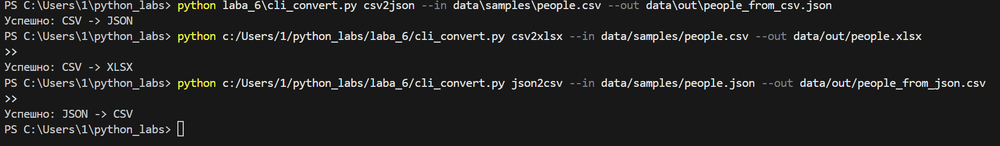
## Лабораторная работа 7

### A
```python
import json
import csv
from pathlib import Path


def check_json_file(path: str):
    if not path.endswith(".json"):
        raise ValueError("Ожидается JSON файл")
    if not Path(path).exists():
        raise FileNotFoundError("Файл не найден")


def check_csv_file(path: str):
    if not path.endswith(".csv"):
        raise ValueError("Ожидается CSV файл")
    if not Path(path).exists():
        raise FileNotFoundError("Файл не найден")


def convert_value(value: str):
    """Преобразует строку в число, если это возможно."""
    if value.isdigit():
        return int(value)

    try:
        return float(value)
    except ValueError:
        return value


def json_to_csv(json_path: str, csv_path: str) -> None:
    json_path_obj = Path(json_path)
    csv_path_obj = Path(csv_path)

    if json_path_obj.suffix != ".json" or csv_path_obj.suffix != ".csv":
        raise ValueError("Неверное расширение файла")

    check_json_file(json_path)

    with open(json_path, "r", encoding="utf-8") as jsonfile:
        data = json.load(jsonfile)

    if not isinstance(data, list) or not data:
        raise ValueError("JSON должен содержать список объектов")

    fieldnames = data[0].keys()

    with open(csv_path, "w", encoding="utf-8", newline="") as csvfile:
        writer = csv.DictWriter(csvfile, fieldnames=fieldnames)
        writer.writeheader()
        writer.writerows(data)


def csv_to_json(csv_path: str, json_path: str) -> None:
    csv_path_obj = Path(csv_path)
    json_path_obj = Path(json_path)

    if csv_path_obj.suffix != ".csv" or json_path_obj.suffix != ".json":
        raise ValueError("Неверное расширение файла")  # ← фикс ошибки №3

    check_csv_file(csv_path)

    with open(csv_path, "r", encoding="utf-8") as csvfile:
        reader = csv.DictReader(csvfile)

        data = []
        for row in reader:
            converted = {k: convert_value(v) for k, v in row.items()}
            data.append(converted)

    with open(json_path, "w", encoding="utf-8") as jsonfile:
        json.dump(data, jsonfile, ensure_ascii=False, indent=4)
```
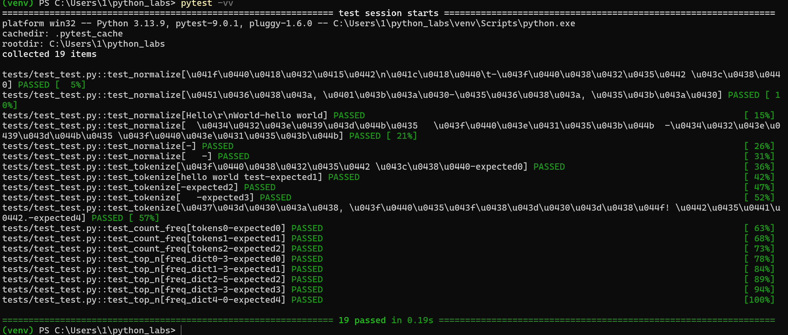


### B

```python
import sys
import os

os.chdir("C:/Users/1/python_labs") #меняет текущую рабочую директорию процесса на указанный путь
sys.path.insert(0, os.getcwd())

import pytest
import csv
import json
from pathlib import Path
from src.laba_5.json_csv import json_to_csv, csv_to_json


def test_json_to_csv_roundtrip(tmp_path: Path):
    src = tmp_path / "people.json"
    dst = tmp_path / "people.csv"
    data = [
        {"name": "Alice", "age": 22},
        {"name": "Bob", "age": 25},
    ]
    src.write_text(json.dumps(data, ensure_ascii=False, indent=2), encoding="utf-8")
    json_to_csv(str(src), str(dst))
    with dst.open(encoding="utf-8") as f:
        rows = list(csv.DictReader(f))
    assert len(rows) == 2
    assert {"name", "age"} <= set(rows[0].keys())


def test_csv_to_json_roundtrip(tmp_path: Path):
    src = tmp_path / "people.csv"
    dst = tmp_path / "people.json"
    data = [
        {"name": "Alice", "age": "22"},
        {"name": "Bob", "age": "25"},
    ]
    with open(src, "w", newline="", encoding="utf-8") as f:
        fieldnames = list(data[0].keys())
        writer = csv.DictWriter(f, fieldnames=fieldnames)
        writer.writeheader()
        writer.writerows(data)
    csv_to_json(str(src), str(dst))
    with dst.open(encoding="utf-8") as f:
        rows = json.load(f)
    assert len(rows) == 2


@pytest.mark.parametrize(
    '''Тест на обработку ошибок'''
    "function, input_file, error",
    [
        (json_to_csv, "people.json", ValueError),
    ],
)
def test_error_handling(function, input_file, error, tmp_path: Path):
    file_path = tmp_path / input_file
    file_path.write_text("Error???", encoding="utf-8")
    dst = tmp_path / "people.csv"
    f = json_to_csv if function is json_to_csv else csv_to_json
    with pytest.raises(error):
        f(str(file_path), str(dst))
```


### Проверка стиль кода

```python
black.
```
```python
black --check .
```
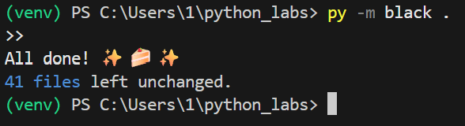


## Лабораторная работа 8
## ООП, dataclass и сериализация JSON (Python)
### Задание А (models.py)
```python
from dataclasses import dataclass #удобный декоратор для автоматического создания методов (__init__, __repr__ и т.д.) в классах с полями.
from datetime import datetime, date
import json
from typing import Dict, Any #типы из typing для подсказок типов (аннотаций)


@dataclass #автоматически создаёт конструктор __init__ и другие стандартные методы
class Student:
    fio: str
    birthdate: str
    group: str
    gpa: float

    def __post_init__(self):
        """проверка данных после создания экземпляра"""
        try:
            datetime.strptime(self.birthdate, "%Y-%m-%d")
        except ValueError:
            raise ValueError(f"Invalid date format: {self.birthdate}. Use YYYY-MM-DD")

        # Валидация среднего балла
        if not (0 <= self.gpa <= 5):
            raise ValueError(f"GPA must be between 0 and 5, got {self.gpa}")

    def age(self) -> int:
        """Вычисление возраста студента"""
        birth_date = datetime.strptime(self.birthdate, "%Y-%m-%d").date()
        today = date.today()
        age = today.year - birth_date.year

        # Корректировка, если день рождения еще не наступил в этом году
        if today.month < birth_date.month or (
            today.month == birth_date.month and today.day < birth_date.day
        ):
            age -= 1

        return age

    def to_dict(self) -> Dict[str, Any]:
        """Преобразует объекта в словарь"""
        return {
            "fio": self.fio,
            "birthdate": self.birthdate,
            "group": self.group,
            "gpa": self.gpa,
        }

    @classmethod
    def from_dict(cls, data):
        '''Cоздание из словаря'''
        return cls(
            fio=data.get("fio") or data.get("name"),
            birthdate=data["birthdate"],
            group=data["group"],
            gpa=data.get("gpa") or data.get("grade"),
        )

    def __str__(self) -> str:
        """Строковое представление объекта"""
        return f"Студент: {self.fio}, Группа: {self.group}, GPA: {self.gpa}, Возраст: {self.age()} лет"


if __name__ == "__main__":
    try:
        student = Student(
            fio="Иванов Иван Иванович", birthdate="2000-05-15", group="SE-01", gpa=4.5
        )
        print(student)
        print(f"Словарь: {student.to_dict()}")
    except ValueError as e:
        print(f"Ошибка: {e}")

```
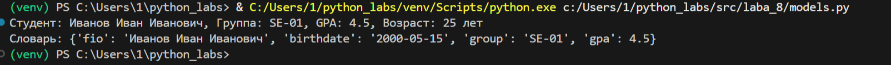
### Задание B (serialize.py)
```python
import json
from typing import List
from models import Student


def students_to_json(students: List[Student], path: str) -> None:
    """Сериализация (строки, числа, списки, словари и т.д.)."""
    data = [student.to_dict() for student in students]

    with open(path, "w", encoding="utf-8") as f:
        json.dump(data, f, ensure_ascii=False, indent=2)


def students_from_json(path: str) -> List[Student]:
    """Десериализация-распаковка, то есть восстановление объекта из JSON обратно в нормальный объект Python."""
    try:
        with open(path, "r", encoding="utf-8") as f:
            data = json.load(f)

        students = []
        for item in data:
            try:
                student = Student.from_dict(item)
                students.append(student)
            except (ValueError, KeyError) as e:
                print(f"Ошибка при создании студента из данных {item}: {e}")
                continue

        return students

    except FileNotFoundError:
        print(f"Файл {path} не найден")
        return []

    except json.JSONDecodeError:
        print(f"Ошибка декодирования JSON из файла {path}")
        return []


if __name__ == "__main__":
    # Пример студентов
    students = [
        Student("Иванов Иван", "2000-05-15", "SE-01", 4.5),
        Student("Петрова Анна", "2001-08-22", "SE-02", 3.8),
        Student("Сидоров Алексей", "1999-12-10", "SE-01", 4.2),
    ]

    # Сохранение
    students_to_json(students, "data/students_output.json")

    # Загрузка
    loaded_students = students_from_json("data/students_input.json")

    for student in loaded_students:
        print(student)

```
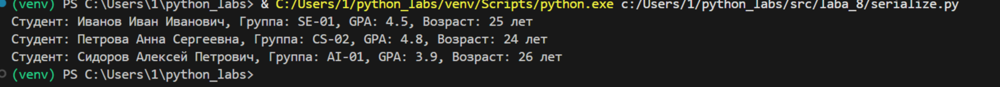


## Лабораторная работа 8
## ООП, dataclass и сериализация JSON (Python)
### Задание А (models.py)
```python
from dataclasses import dataclass #удобный декоратор для автоматического создания методов (__init__, __repr__ и т.д.) в классах с полями.
from datetime import datetime, date
import json
from typing import Dict, Any #типы из typing для подсказок типов (аннотаций)


@dataclass #автоматически создаёт конструктор __init__ и другие стандартные методы
class Student:
    fio: str
    birthdate: str
    group: str
    gpa: float

    def __post_init__(self):
        """проверка данных после создания экземпляра"""
        try:
            datetime.strptime(self.birthdate, "%Y-%m-%d")
        except ValueError:
            raise ValueError(f"Invalid date format: {self.birthdate}. Use YYYY-MM-DD")

        # Валидация среднего балла
        if not (0 <= self.gpa <= 5):
            raise ValueError(f"GPA must be between 0 and 5, got {self.gpa}")

    def age(self) -> int:
        """Вычисление возраста студента"""
        birth_date = datetime.strptime(self.birthdate, "%Y-%m-%d").date()
        today = date.today()
        age = today.year - birth_date.year

        # Корректировка, если день рождения еще не наступил в этом году
        if today.month < birth_date.month or (
            today.month == birth_date.month and today.day < birth_date.day
        ):
            age -= 1

        return age

    def to_dict(self) -> Dict[str, Any]:
        """Преобразует объекта в словарь"""
        return {
            "fio": self.fio,
            "birthdate": self.birthdate,
            "group": self.group,
            "gpa": self.gpa,
        }

    @classmethod
    def from_dict(cls, data):
        '''Cоздание из словаря'''
        return cls(
            fio=data.get("fio") or data.get("name"),
            birthdate=data["birthdate"],
            group=data["group"],
            gpa=data.get("gpa") or data.get("grade"),
        )

    def __str__(self) -> str:
        """Строковое представление объекта"""
        return f"Студент: {self.fio}, Группа: {self.group}, GPA: {self.gpa}, Возраст: {self.age()} лет"


if __name__ == "__main__":
    try:
        student = Student(
            fio="Иванов Иван Иванович", birthdate="2000-05-15", group="SE-01", gpa=4.5
        )
        print(student)
        print(f"Словарь: {student.to_dict()}")
    except ValueError as e:
        print(f"Ошибка: {e}")

```

### Задание B
```python
import json
from typing import List
from models import Student


def students_to_json(students: List[Student], path: str) -> None:
    """Сериализация"""
    data = [student.to_dict() for student in students]

    with open(path, "w", encoding="utf-8") as f:
        json.dump(data, f, ensure_ascii=False, indent=2)


def students_from_json(path: str) -> List[Student]:
    """Десериализация"""
    try:
        with open(path, "r", encoding="utf-8") as f:
            data = json.load(f)

        students = []
        for item in data:
            try:
                student = Student.from_dict(item)
                students.append(student)
            except (ValueError, KeyError) as e:
                print(f"Ошибка при создании студента из данных {item}: {e}")
                continue

        return students

    except FileNotFoundError:
        print(f"Файл {path} не найден")
        return []

    except json.JSONDecodeError:
        print(f"Ошибка декодирования JSON из файла {path}")
        return []


if __name__ == "__main__":
    # Пример студентов
    students = [
        Student("Иванов Иван", "2000-05-15", "SE-01", 4.5),
        Student("Петрова Анна", "2001-08-22", "SE-02", 3.8),
        Student("Сидоров Алексей", "1999-12-10", "SE-01", 4.2),
    ]

    # Сохранение
    students_to_json(students, "data/students_output.json")

    # Загрузка
    loaded_students = students_from_json("data/students_input.json")

    for student in loaded_students:
        print(student)


```

### Лабораторная работа 9
### A
```python
import csv
from pathlib import Path
from typing import List, Dict, Any

try:
    from src.laba_8.models import Student
except ImportError:

    class Student:
        def __init__(self, fio: str, birthdate: str, group: str, gpa: float):
            self.fio = fio
            self.birthdate = birthdate
            self.group = group
            self.gpa = gpa

        def __repr__(self):
            return f"Student(fio='{self.fio}', birthdate='{self.birthdate}', group='{self.group}', gpa={self.gpa})"

        def __str__(self):
            return f"{self.fio}, {self.birthdate}, {self.group}, GPA: {self.gpa}"

        def to_dict(self):
            return {
                "fio": self.fio,
                "birthdate": self.birthdate,
                "group": self.group,
                "gpa": str(self.gpa),
            }

        @classmethod
        def from_dict(cls, data):
            return cls(
                data["fio"], data["birthdate"], data["group"], float(data["gpa"])
            )


class Group:
    HEADER = ["fio", "birthdate", "group", "gpa"]

    def __init__(self, storage_path: str):
        self.path = Path(storage_path)
        self._ensure_storage_exists()

    def _ensure_storage_exists(self):
        """Создаёт файл с заголовком, если его нет."""
        if not self.path.exists():
            self.path.parent.mkdir(parents=True, exist_ok=True)
            with open(self.path, "w", newline="", encoding="utf-8") as f:
                csv.DictWriter(f, fieldnames=self.HEADER).writeheader()

    def _read_rows(self) -> List[Dict]:
        with open(self.path, "r", encoding="utf-8") as f:
            return list(csv.DictReader(f))

    def _write_rows(self, rows: List[Dict]):
        with open(self.path, "w", newline="", encoding="utf-8") as f:
            writer = csv.DictWriter(f, fieldnames=self.HEADER)
            writer.writeheader()
            writer.writerows(rows)

    def exists(self, fio: str) -> bool:
        """Проверяет, существует ли студент с таким ФИО."""
        return any(row["fio"] == fio for row in self._read_rows())

    def list(self) -> List[Student]:
        return [Student.from_dict(row) for row in self._read_rows()]

    def add(self, student: Student):
        rows = self._read_rows()
        if any(row["fio"] == student.fio for row in rows):
            raise ValueError(f"Студент '{student.fio}' уже существует")
        rows.append(student.to_dict())
        self._write_rows(rows)

    def find(self, substr: str) -> List[Student]:
        rows = [r for r in self._read_rows() if substr.lower() in r["fio"].lower()]
        return [Student.from_dict(row) for row in rows]

    def remove(self, fio: str) -> bool:
        rows = self._read_rows()
        new_rows = [r for r in rows if r["fio"] != fio]
        if len(new_rows) != len(rows):
            self._write_rows(new_rows)
            return True
        return False

    def update(self, fio: str, **fields) -> bool:
        rows = self._read_rows()
        updated = False

        for row in rows:
            if row["fio"] == fio:
                for key, value in fields.items():
                    if key in self.HEADER:
                        row[key] = str(value) if key == "gpa" else value
                updated = True

        if updated:
            self._write_rows(rows)
        return updated

    def print_with_age(self, current_year: int = 2025):
        """Выводит всех студентов с возрастом"""
        students = self.list()
        for student in students:
            birth_year = int(student.birthdate.split(".")[0])
            age = current_year - birth_year
            print(
                f"Студент: {student.fio}, Группа: {student.group}, GPA: {student.gpa}, Возраст: {age}"
            )

    def stats(self) -> Dict[str, Any]:
        students = self.list()
        if not students:
            return {
                "count": 0,
                "min_gpa": None,
                "max_gpa": None,
                "avg_gpa": None,
                "groups": {},
                "top_5_students": [],
            }

        gpas = [s.gpa for s in students]
        groups = {}
        for s in students:
            groups[s.group] = groups.get(s.group, 0) + 1

        sorted_students = sorted(students, key=lambda s: s.gpa, reverse=True)

        return {
            "count": len(students),
            "min_gpa": min(gpas),
            "max_gpa": max(gpas),
            "avg_gpa": round(sum(gpas) / len(students), 2),
            "groups": groups,
            "top_5_students": [
                {"fio": s.fio, "gpa": s.gpa} for s in sorted_students[:5]
            ],
        }

    def __str__(self):
        students = self.list()
        if not students:
            return "Группа пуста"
        return "\n".join(
            [
                f"Всего студентов: {len(students)}",
                *[
                    f"{i+1}. {s.fio} | {s.birthdate} | {s.group} | GPA: {s.gpa}"
                    for i, s in enumerate(students)
                ],
            ]
        )


if __name__ == "__main__":
    group = Group("data/lab09/students.csv")
    group._write_rows([])

    # СПИСОК ДЛЯ ДОБАВЛЕНИЯ
    students_to_add = [
        Student("Макаров Георгий Васильевич", "2006.12.16", "BIVT-25", 4.6),
        Student("Ильин Илья Ильич", "2007.03.16", "BIVT-24", 4.5),
        Student("Петрова София Алексеевна", "2005.01.01", "BIVT-23", 4.9),
    ]

    # БЕЗОПАСНОЕ ДОБАВЛЕНИЕ (без ошибок)
    for s in students_to_add:
        if not group.exists(s.fio):
            group.add(s)
            print(f"Добавлен: {s.fio}")
        else:
            print(f"Студент {s.fio} уже существует — пропускаю.")

    group.print_with_age()
    # group.remove("Алексеев Алексей Алексеевич")
    # print(f"\nПосле удаления Алексеева, всего студентов: {len(group.list())}")
    # group.print_with_age()

    # group.remove("Петров Пётр Петрович")
    # group.print_with_age()

    # group.update("Николаев Николай Николаевич", gpa=4.9)
    # group.print_with_age()
    group.remove("Алексеев Алексей Алексеевич")
    print(f"\nПосле удаления Алексеева, всего студентов: {len(group.list())}")
    print("Студенты:")
    for student in group.list():
        print(f"  {student}")

    print("\nПоиск по 'Петрова':")
    for student in group.find("Петрова"):
        print(f"  {student}")

    print("\nСтатистика:")
    stats = group.stats()
    for key, value in stats.items():
        if key == "top_5_students":
            print(f"  {key}:")
            for student in value:
                print(f"    {student['fio']} - GPA: {student['gpa']}")
        else:
            print(f"  {key}: {value}")

```
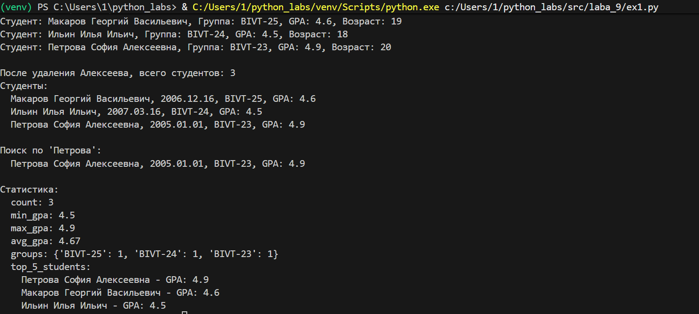


## Лабораторная работа 10
## Задание 1
```python
from collections import deque


class Stack:
    def __init__(self, array=None):
        self._data = array if array is not None else []

    def push(self, item):
        """Добавить элемент в стек"""
        self._data.append(item)

    def pop(self):
        """Удалить и вернуть верхний элемент"""
        if self.is_empty():
            raise IndexError("Нельзя удалить из пустого стека")
        return self._data.pop()

    def peek(self):
        """Посмотреть верхний элемент без удаления"""
        if self.is_empty():
            return None
        return self._data[-1]

    def is_empty(self):
        """Проверить, пуст ли стек"""
        return len(self._data) == 0

    def __len__(self):
        """Вернуть количество элементов"""
        return len(self._data)

    def __str__(self):
        """Строковое представление стека"""
        return str(self._data)


class Queue:
    def __init__(self, array=None):
        self._data = deque(array if array is not None else [])

    def enqueue(self, item):
        """Добавить элемент в очередь"""
        self._data.append(item)

    def dequeue(self):
        """Удалить и вернуть первый элемент"""
        if self.is_empty():
            raise IndexError("Нельзя удалить из пустой очереди")
        return self._data.popleft()

    def peek(self):
        """Посмотреть первый элемент без удаления"""
        if self.is_empty():
            return None
        return self._data[0]

    def is_empty(self):
        """Проверить, пуста ли очередь"""
        return len(self._data) == 0

    def __len__(self):
        """Вернуть количество элементов"""
        return len(self._data)

    def __str__(self):
        """Строковое представление очереди"""
        return str(list(self._data))


if __name__ == "__main__":
    print("Тестирование")
    s = Stack()
    s.push(8)
    print(f"Удален из стека: {s.pop()}")
    print(f"Просмотр пустого стека: {s.peek()}")
    print(f"Длина стека: {len(s)}")
    print(f"Стек пуст? {s.is_empty()}")
    que = Queue()
    que.enqueue(4)
    print(f"Удален из очереди: {que.dequeue()}")
    print(f"Просмотр пустой очереди: {que.peek()}")
    print(f"Длина очереди: {len(que)}")
    print(f"Очередь пуста? {que.is_empty()}")
```


## Задание 2
``` python
from typing import Any, Optional, Iterator


class Node:
    def __init__(self, value: Any, next_node: Optional["Node"] = None) -> None:
        self.value = value
        self.next = next_node

    def __repr__(self) -> str:
        return f"[{self.value}]"


class SinglyLinkedList:
    def __init__(self) -> None:
        self.head: Optional[Node] = None
        self.tail: Optional[Node] = None
        self._size: int = 0

    def append(self, value: Any) -> None:
        """Добавить элемент в конец списка за O(1)."""
        new_node = Node(value)
        if self.tail is None:
            self.head = self.tail = new_node
        else:
            self.tail.next = new_node
            self.tail = new_node
        self._size += 1

    def prepend(self, value: Any) -> None:
        """Добавить элемент в начало списка за O(1)."""
        new_node = Node(value, self.head)
        self.head = new_node
        if self.tail is None:
            self.tail = new_node
        self._size += 1

    def insert(self, idx: int, value: Any) -> None:
        """Вставить элемент по индексу idx.
        Допустимые индексы: от 0 до len(self) включительно.
        """
        if idx < 0 or idx > len(self):
            raise IndexError("list index out of range")
        if idx == 0:
            self.prepend(value)
            return
        if idx == len(self):
            self.append(value)
            return
        current = self.head
        for _ in range(idx - 1):
            assert current is not None
            current = current.next
        new_node = Node(value, current.next)
        current.next = new_node
        self._size += 1

    def remove_at(self, idx: int) -> None:
        """Удалить элемент по индексу."""
        if idx < 0 or idx >= len(self):
            raise IndexError("list index out of range")
        if idx == 0:
            assert self.head is not None
            self.head = self.head.next
            if self.head is None:
                self.tail = None
            self._size -= 1
            return
        current = self.head
        for _ in range(idx - 1):
            assert current is not None
            current = current.next
        assert current is not None and current.next is not None
        current.next = current.next.next
        if current.next is None:
            self.tail = current
        self._size -= 1

    def __iter__(self) -> Iterator[Any]:
        """Итерация по значениям списка (от головы к хвосту)."""
        current = self.head
        while current:
            yield current.value
            current = current.next

    def __len__(self) -> int:
        return self._size

    def __repr__(self) -> str:
        return f"SinglyLinkedList({list(self)})"

    def display(self) -> str:
        """Красивый вывод: [A] -> [B] -> [C] -> None"""
        if self.head is None:
            return "None"
        parts = []
        current = self.head
        while current:
            parts.append(f"[{current.value}]")
            current = current.next
        return " -> ".join(parts) + " -> None"


if __name__ == "__main__":
    lst = SinglyLinkedList()
    lst.append(1)
    lst.append(2)
    lst.prepend(0)
    lst.insert(2, 1.5)
    lst.remove_at(3)
    print(lst)
    print(lst.display())
```
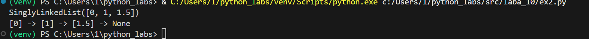