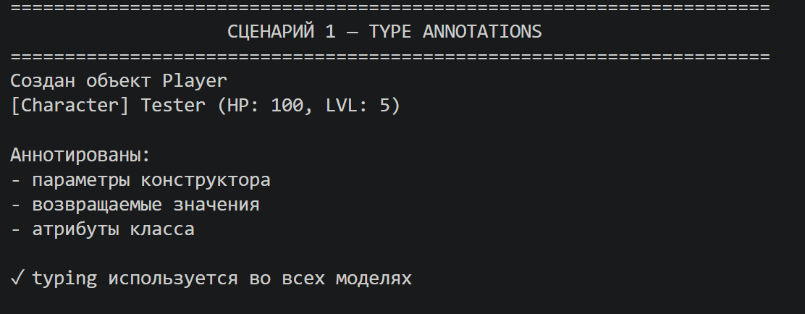
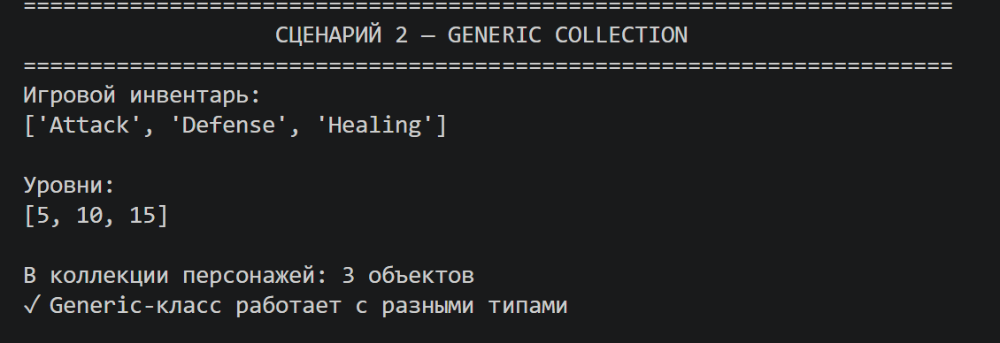
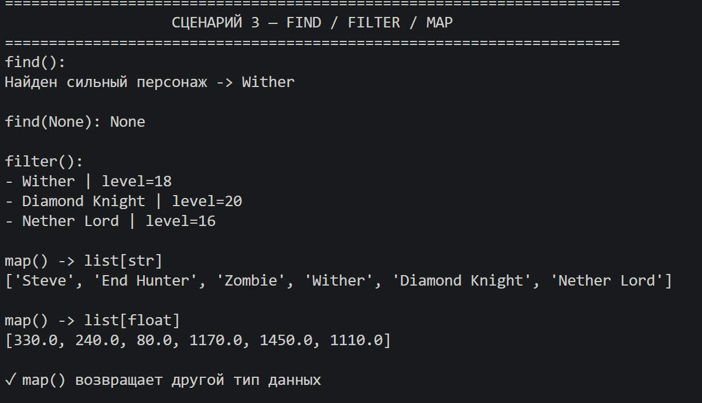
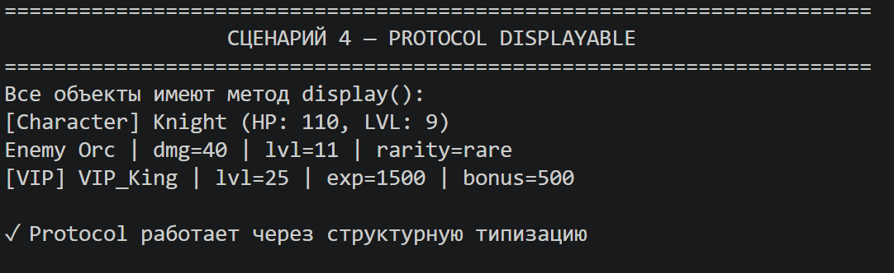
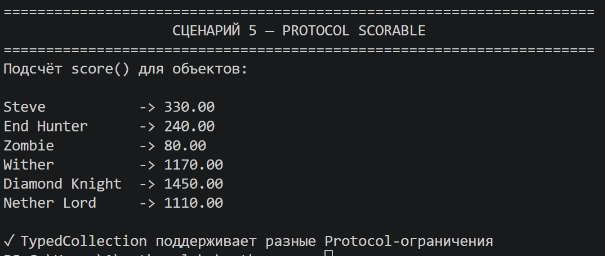

# Лабораторная работа №6 — Generics и typing


## 1. Цель работы

* Освоить систему аннотаций типов в Python (`typing`).
* Научиться создавать **обобщённые (generic) классы** с помощью `TypeVar` и `Generic`.
* Понять концепцию **структурной типизации** через `typing.Protocol`.
---


# 2. Описание реализованных типов и контейнеров

## Аннотации типов в игровых классах

В работе использованы игровые классы:

- Player
- Enemy
- PremiumPlayer
- Character — базовый класс

Во всех классах добавлены аннотации типов.

### Что типизировано

- параметры конструкторов  
  (`name: str`, health: int, level: int, `exp: int`)
- внутренние атрибуты  
  (`_level: int`, `_health: int`)
- возвращаемые значения методов  
  (`-> int`, -> float, `-> str`)
- свойства (`@property`)

### Преимущества

- код становится понятнее и самодокументируемым
- IDE показывает подсказки типов
- снижается вероятность ошибок при разработке

---

## Generic-класс TypedCollection

TypedCollection — обобщённая коллекция для хранения игровых объектов или любых других типов данных.

Она повторяет функциональность коллекции из предыдущих лабораторных работ, но теперь поддерживает строгую типизацию.

### TypeVar и их назначение

| TypeVar | Ограничение | Назначение |
|---|---|---|
| T | нет | базовый тип элементов коллекции |
| R | нет | тип результата в map() |
| D | bound=Displayable | объекты с методом display() |
| S | bound=Scorable | объекты с методом score() |

### Основные методы коллекции

- add(item: T) — добавление элемента
- remove(item: T) — удаление элемента
- remove_at(index: int) — удаление по индексу
- get_all() -> list[T] — получение всех элементов

### Методы поиска и обработки

- find(predicate) — возвращает первый подходящий элемент или None
- filter(predicate) — возвращает список элементов
- map(transform) — преобразует элементы в другой тип R

### Особенности map

Метод map() позволяет менять тип данных:

- TypedCollection[Player] -> list[str] — имена
- TypedCollection[Player] -> list[float] — score
- TypedCollection[Player] -> list[tuple] — составные данные

Это реализовано через второй TypeVar R.

### Работа с коллекцией

- len() — количество элементов
- iter() — поддержка циклов
- getitem() — доступ по индексу

---

## Протоколы (структурная типизация)

В работе используются два протокола.

### Displayable

Требует метод:

```python
display() -> str
```
Отвечает за строковое представление объекта (для вывода в игре).

### Scorable
Требует метод:
score() -> float

Отвечает за числовую оценку силы персонажа.

### Суть протоколов
- классы НЕ наследуются от Protocol
- соответствие определяется наличием методов
- используется структурная типизация (`duck typing` на уровне типов)

### Соответствие игровых классов
Все игровые классы:
- Player
- Enemy
- PremiumPlayer

подходят под оба протокола, потому что:
- имеют метод display()
- имеют метод score() (через `calculate_power()`)

---

# 3. Демонстрация работы

## Сценарий 1 — аннотации типов

Показывается:
- создание объекта Player
- типизированные параметры конструктора
- корректные возвращаемые значения методов



### Результат
IDE корректно определяет все типы, код становится понятным и предсказуемым.

---

## Сценарий 2 — Generic-коллекция

Показывается работа TypedCollection с разными типами:
- TypedCollection[str] — игровые предметы
- TypedCollection[int] — уровни персонажей
- TypedCollection[Player] — игровые персонажи



### Результат
Коллекция строго контролирует тип данных.

---

## Сценарий 3 — find / filter / map
Исходные данные:
набор персонажей (`Player`, Enemy, `PremiumPlayer`)
  


### Результаты
- find() — поиск сильного персонажа
- filter() — фильтрация по уровню
- map() — получение:
  - имён (`list[str]`)
  - силы (`list[float]`)

---

## Сценарий 4 — Protocol Displayable
Показывается:
- коллекция TypedCollection[D]
- разные типы объектов
- вызов display() без явного наследования



### Результат
Все объекты корректно выводятся в строковом виде.

---

## Сценарий 5 — Protocol Scorable
Показывается:
- коллекция TypedCollection[S]
- вызов score() у разных типов персонажей



### Результат
Все персонажи имеют числовую оценку силы.

---

# 4. Вывод

В ходе работы были изучены:

## Аннотации типов
Добавлены во все игровые классы, что улучшило читаемость и поддержку кода.

## Generic и TypeVar
Реализована универсальная коллекция TypedCollection, работающая с любыми типами данных.

---

## map с изменением типа
Показано преобразование:
- Player → str
- Player → float

через второй TypeVar.

---

## Protocol (структурная типизация)
Объекты разных классов могут использоваться одинаково, если имеют нужные методы.

---

## bound ограничения
Использование bound=Displayable и bound=Scorable обеспечивает типовую безопасность.

---

## Практический результат
Типизация позволяет:
- снижать количество ошибок
- улучшать читаемость
- упрощать поддержку кода
- помогать IDE анализировать проект

---

# Итог
Реализованы:
- аннотации типов
- `Generic`-класс
- TypeVar (включая `bound`)
- Protocol
- методы find / filter / map
- демонстрационные сценарии

