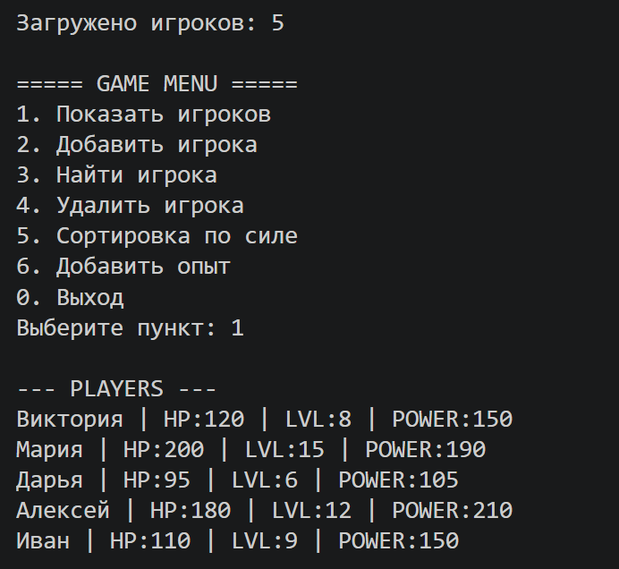
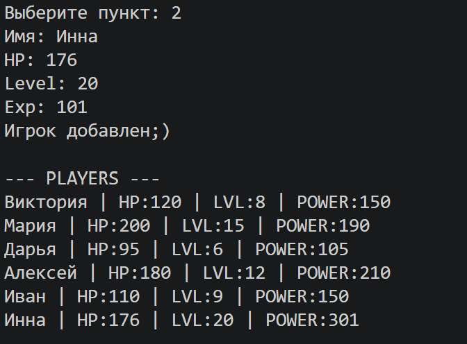
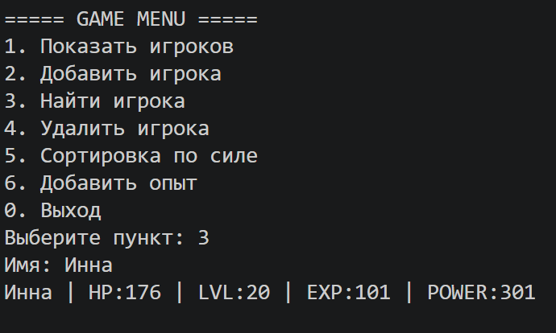
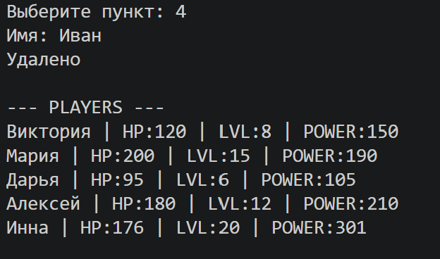
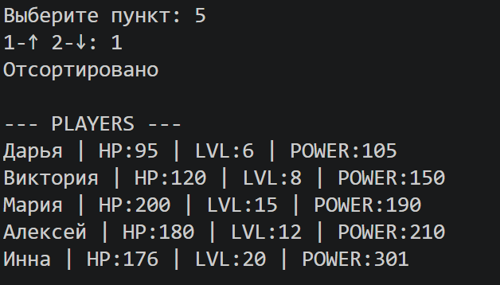
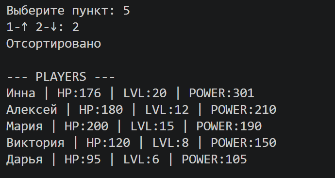
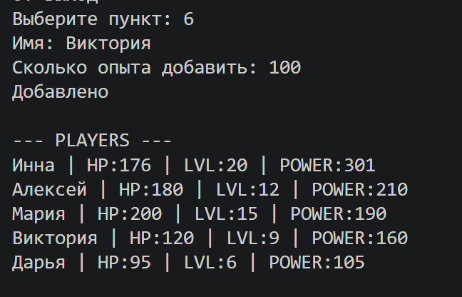

# Лабораторная работа №7 — Консольное приложение RPG Game System

## 1. Цель работы

Целью лабораторной работы является объединение знаний, полученных в предыдущих лабораторных работах (ЛР1–ЛР6), в единое консольное приложение с интерактивным CLI-интерфейсом.

В ходе выполнения работы было реализовано приложение для управления игровыми персонажами RPG.

В приложении были применены следующие технологии и концепции:

- объектно-ориентированное программирование;
- наследование классов;
- работа с коллекциями объектов;
- обработка пользовательского ввода;
- сохранение и загрузка данных в JSON;
- сортировка объектов;
- обработка исключений;
- разделение программы на логические модули.

---

# 2. Описание приложения

Приложение представляет собой систему управления игровыми персонажами.

Используются следующие классы:

- `Player`
- `Enemy`
- `PremiumPlayer`

Программа позволяет:

- просматривать игроков;
- добавлять новых игроков;
- искать игроков;
- удалять игроков;
- сортировать игроков по силе;
- добавлять опыт персонажам;
- сохранять и загружать данные автоматически.

---

# 3. Описание CLI

## Пункты меню

| Пункт | Описание |
|---|---|
| 1 | Показать игроков |
| 2 | Добавить игрока |
| 3 | Найти игрока |
| 4 | Удалить игрока |
| 5 | Сортировка по силе |
| 6 | Добавить опыт |
| 0 | Выход |

---

## Обработка ошибок

Приложение обрабатывает основные ошибки пользовательского ввода.

### Поддерживаемые ошибки

| Ошибка | Сообщение |
|---|---|
| Неверный пункт меню | `Неверный пункт` |
| Игрок не найден | `Не найден` |
| Отрицательный опыт | `Опыт не может быть отрицательным` |
| Ввод текста вместо числа | `ValueError` |
| Ошибка загрузки файла | `Ошибка загрузки данных` |

---

## Сохранение и загрузка данных

При запуске приложения автоматически выполняется загрузка данных из файла:

```text
data/players.json
```

При завершении работы все данные автоматически сохраняются обратно в JSON-файл.

Если папка `data` отсутствует, она создаётся автоматически.

---

# 4 Демонстрация работы

---

# Сценарий 1: Автоматическая загрузка игроков



## Что демонстрируется

Автоматическая загрузка персонажей из JSON-файла при запуске программы и вывод списка всех игроков с их характеристиками.

---

# Сценарий 2: Добавление игрока



## Что демонстрируется

Создание нового персонажа через CLI-интерфейс.

---

# Сценарий 3: Поиск игрока
 


## Что демонстрируется

Поиск персонажа по имени.

---
# Сценарий 4: Удаление игрока



## Что демонстрируется

Удаление персонажа из коллекции игроков.
---

# Сценарий 5: Сортировка игроков




## Что демонстрируется

Сортировка игроков по силе в порядке возрастания или убывания.
---


# Сценарий 6: Добавление опыта



## Что демонстрируется

Добавление опыта персонажу и автоматическое повышение уровня.

---

# Сценарий 7: Сохранение данных
 


## Что демонстрируется

Автоматическое сохранение данных при выходе из программы.
---

# 6. Вывод

В ходе выполнения лабораторной работы было разработано консольное приложение для управления игровыми персонажами RPG.

В процессе выполнения были применены следующие концепции:

- объектно-ориентированное программирование;
- наследование и полиморфизм;
- работа с JSON;
- работа с коллекциями объектов;
- сортировка через lambda-функции;
- обработка пользовательского ввода;
- создание CLI-интерфейса;
- сохранение и загрузка данных.

Разработанное приложение демонстрирует практическое применение Python для создания полноценных консольных систем с хранением данных и интерактивным управлением.